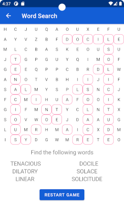
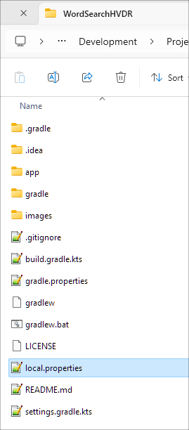
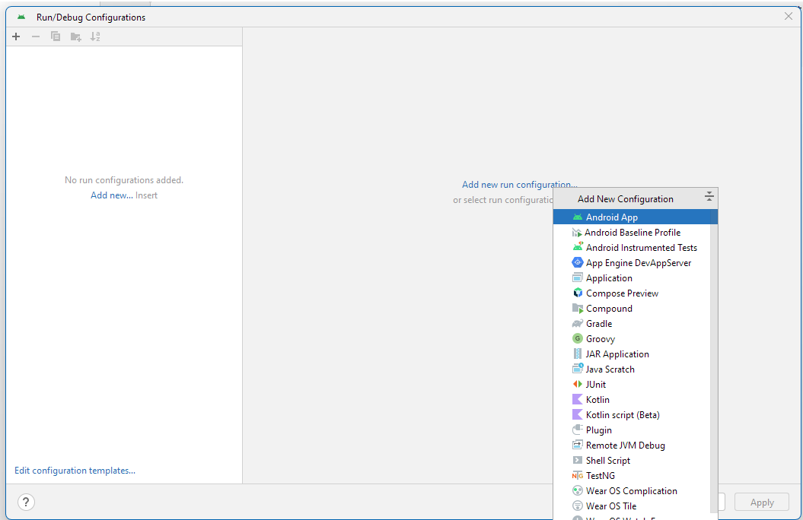
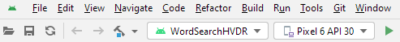
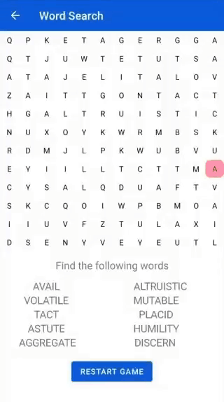

# WordSearchHVDR

__Description:__ Word search puzzle for Android written in Kotlin.

__IDE:__ Android Studio | 2023.3.1

__Device SDK Version:__ 30

__Android Version:__ 11

__Kotlin Version:__ 1.9.0

__Project Version:__ 1.0

__Date:__ 5/4/2024

__Supported Language:__ U.S. English (only)

__License:__ MIT License

---

### Table of Contents

* [App Features](#app-features)
* [App Configuration Options](#app-configuration-options)
* [App Word Repository](#app-word-repository)
* [Screen Sample](#screen-samples)
* [Project Import Tips](#project-import-tips)
* [Configure Run Environment](#configure-run-environment)
* [AndroidTest](#androidtest)
* [Readme File](#readme-file)

---

## App Features

### Word Placement
* Word placement direction (HVDR):
	* Horizontal
	* Vertical
	* Diagonal Down
	* Diagonal Up
	* Reversed
* Word placement can be Reversed for any direction.
* Word placement is attempted for each direction. If a placement is not found for any of the directions, then the word is excluded.

### Word Selection
* Word selection is performed by clicking the start of the word then clicking the end of the word. The selection can also be reversed (clicking the end of the word then clicking the start of the word).
* Selecting a word will produce a random color for the word selection.

### Game Buttons
* __Restart Game__ button will restart the game and reset any progress.
* __Show Result__ button will show the words by marking them with a red border.

### Misc
* Support for night theme (excludes the gameboard).
* No support for screen rotation (portrait only).

---

## App Configuration Options

Class `WordSearchValues` contains all configuration variables.
1. Variable `gameboardDimension` - size of the gameboard (set to 12x12).
	* The larger the value, the more likely the gameboard will not fit the resolution of the device.

2. Variable `maxWordLength` - maximum length of the word from the repository to place on the gameboard (set to 10).
	* `maxWordLenght` must be less than or equal to gameboard dimension.
	* The smaller the length, the more likely the app will find a placement for the word on the gameboard.

3. Variable `maxWords` - the number of words to place on the gameboard (set to 6).
	* Must be an even number between 2 and 10.
	* The larger the value, the more likely the app will not find a placement for the word on the gameboard.
	* The larger the value, the more likely the buttons will not fit the resolution of the device.

4. Variable `maxPlacementAttempts` - number of attempts to find a word placement on the gameboard (set to 50).
	* If no replacement is found the word is excluded.
	* If this value is set too high may cause the app to crash.

5. Variable `maxWordAttempts` - number of attempts to found a word from the repository that is equal to or less than `maxWordLength` (set to 100).

6. Variable `enableShowResultButton` - ability to show or hide the `Show Result` button (set to true).

> Note: Each of the above variables will affect the app performance and most be changed with caution.

---

## App Word Repository

Class `WordRepository` contain a list of 40 words as a simple repository.
* The length of the word varies. For example, *Imperceptible* is 13 characters and will never be selected for a gameboard dimension of 12x12.
* Variable `wordSet` is a Set and duplicate words will not exist.

> Note: It's worth mentioning that this is not a best practice and `WordRepository` should be referencing a SQLite/Room database.

---

## Screen Samples

| Beginning screen of WordSearchHVDR|
|-----------------------------------|
|  |

| Show Result button selected                |
|--------------------------------------------|
|  |


| End of game screen                         |
|--------------------------------------------|
|       |

---

## Project Import Tips

After cloning this project and opening it in Android Studio, you may receive the following notification.


or


Try the following:

Select the link `Select the Gradle JDK location`.

Update the `Gradle user home` with your Gradle install directory (see screenshot below).
This location should be within your home directory.
Replace the underscores with your user name.

> Note: This path is dependent on your Android Studio and Gradle installation.


After updating the Gradle configuration, ensure the above step created a Gradle `local.properties` file in the project root directory and that it contains the Gradle SDK directory.



The contents of `local.properties` should be your Gradle SDK directory.

```
## This file is automatically generated by Android Studio.
# Do not modify this file -- YOUR CHANGES WILL BE ERASED!
#
# This file should *NOT* be checked into Version Control Systems,
# as it contains information specific to your local configuration.
#
# Location of the SDK. This is only used by Gradle.
# For customization when using a Version Control System, please read the
# header note.
sdk.dir=C\:\\Users\\______\\AppData\\Local\\Android\\Sdk
```

Also try running Gradle Sync:

`File -> Sync Project with Gradle Files`

Then rebuild the project.

`Build -> Make Project`

---

## Configure Run Environment

To setup an Android run environment, select `Add Configuration...`.


Next select `Add new run configuration...` then select Android App.



Setup the following configuration.


After the run environment is configured, ensure you have an emulator (Pixel 6 API 30) configured or your personal Android device is connected.



---

## AndroidTest

To validate the app, run the following Android tests.

* MainActivityTest
* WordSearchMainActivityTest

| Sample of running WordSearchMainActivityTest  |
|---|
|   |

---

## Readme File

Android Studio may not display a preview of the README.md file. Just view it from GitHub.
